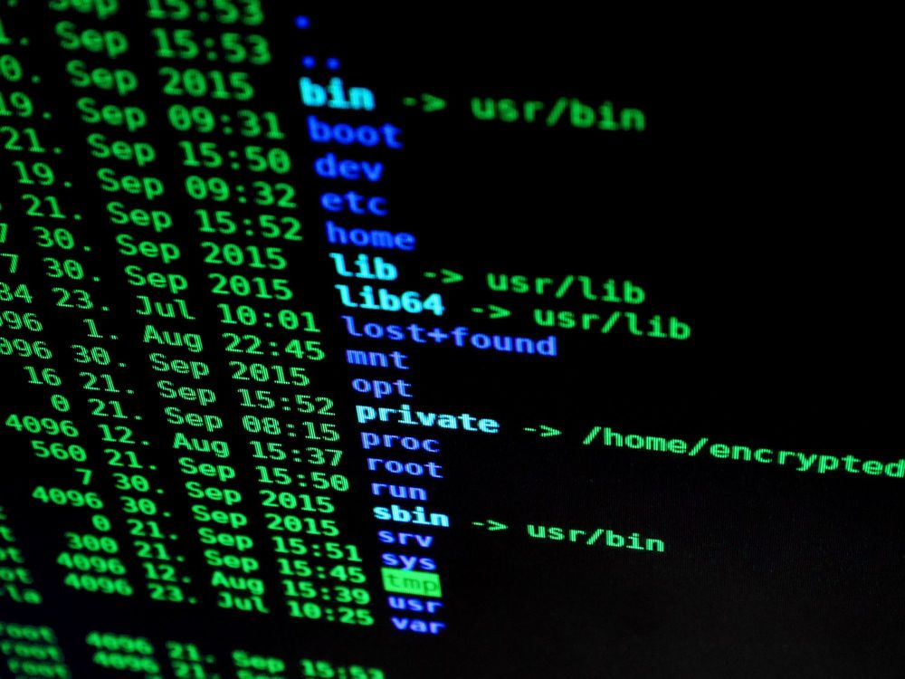

今晚的月色如水，風輕輕拂過，溫柔而寧靜。

子辰站在窗前，手中握著一杯泡滿枸杞的保溫杯，目光穿過窗外川流不息的馬路，深深地吐出一口濁氣。

這裡，是他夢想生根發芽的地方，也是夢想逐漸枯萎、凋零的地方。

今天下午，他收到了父母的最後通牒：三天後，必須回到老家見面。

18歲那年，他從中原一個小縣城來到這個充滿魔幻色彩的大都市，開始了求學與工作的生活。

如今，已經在這座沒有歸屬感的城市漂泊了整整12年。

這12年的歲月，雖然飽經風霜，但子辰也從中獲得了不少經歷與成長。

他見證了杭城從一個小城鎮逐漸走向繁華，也曾在愛情的滋潤與摧殘中經歷起伏。

這些年，他談過幾段戀愛，然而悲哀的是，直到今天，卻還沒有一個人願意嫁給他，愛情對他而言，只剩下深深的回味。

上周，公司的一名設計師離職，他的辦公室戀情也在遺憾中結束，自己再次成為了單身貴族。

子辰大學畢業後換過四份工作，從一名實習生逐步晉升至一家上市企業的部門總監，月薪從6K漸漸增至30K。

這一路走來，他也從一個朝氣蓬勃的少年，變成了一個仍然在租房過日的油膩大叔。

歲月，真的是把殺豬刀！

它無聲無息，卻又不可逆地改變了一個人。

一根煙抽完，子辰滿是留戀地望向這座不夜城，心事重重地轉身坐回辦公室的真皮沙發上。

他靠在沙發上，重新打開手機上的微信。

界面是一個四人小群，群名：「相親相愛一家人」。

翻看著聊天記錄，裡面全是爸媽和姐姐發來的語音消息。

“辰辰，前天你張阿姨介紹了一個女孩，和你同歲，回來見一面吧。”

“還有你秦阿姨那個人，也不知道安的是什麼心思，竟然要給你介紹個二婚帶娃的女人。”

這是媽媽的話。

話裡話外，都是希望他回老家相親，早點結婚的意思。而且，言辭之間透露出明確的警告——如果再等幾年，他可能只能選擇二婚帶娃的女人。

“辰辰，我還有兩年就要退休了，你媽媽上個月已經退休了。”

“早點回來吧，趁我們還年輕，結婚生子，踏實過日子吧！”

爸爸的語氣，也帶著強烈的期望，想讓他回家發展，順從現實，早早承擔起家庭的責任，畢竟，兩位老人都快退休了，未來這個家要靠他來支撐。

至於姐姐，她沒有說太多，只是順著父母的話，耐心地給他講道理。

自從昨天以來，子辰反復翻看著「相親相愛一家人」群裡的消息，心中充滿了思考。

父母說的話無疑是正確且現實的。

儘管他現在的收入看似不錯，但也不確定是否能夠持久。這些年，他並未積攢多少儲蓄，在杭城買房、安定下來更是遙不可及的夢想。

然而，心中的不甘與抵觸情緒卻始終未曾消散，他始終拒絕接受這樣的安排。

直到今天，公司總部的人力資源總監找他談話，告訴他公司今年的效益特別差，處於生死存亡的關頭，接下來將進行大規模裁員，並要求每個人的工作效能大幅提升。

話語中的含義其實再明白不過，那就是在勸退他。

對於一名總監級別的員工，且有五年資歷，公司所提供的辭職待遇是三個月的工資補償。

雖然這明顯違反勞動法，但子辰明白，這也是最現實的選擇。

普通員工可以要求N+1，但作為總監的他，卻無權提出這個要求。

自從成為打工人那一刻起，子辰就知道這一天終究會來臨。

畢竟，這裡是杭城，人才如雲，是全國電商行業最為競爭的城市。

他沉默了片刻，隨後在群裡回復了兩個字：“好的。”

當這兩個字發出去的瞬間，子辰緊握手機的手指青筋暴起，內心的不甘與抗拒達到了頂點。

十二年啊！

人生中又有多少個十二年呢？

儘管子辰心中充滿不甘，但當他想起年邁的父母，想到杭城那高得讓人望而卻步的房價，再看看自己略微隆起的肚子，他的內心瞬間崩潰，彷彿一個漏氣的氣球，無力地癱倒在沙發上。

老老實實地過平凡生活吧！  
三十歲了，未來的路幾乎已經看得見終點，平庸才是常態，不如回老家，按部就班地活下去。

然而，

子辰還是做了最後的抗爭，在「相親相愛一家人」群裡發了最後一句話。

“一周後我回家！”

這是他最後的倔強，是他對這座城市最後的留戀。

當這句話發出的瞬間，他感覺自己好像耗盡了所有的力氣，整個人癱軟在沙發上。

“有一種愛叫做放手、為愛放棄天長地久~”

他的手機被丟在茶几上，鈴聲和震動聲交織響起。

但此刻的子辰，完全不想動，也不願接任何人的電話，任由手機在茶几上顫動。

鈴聲終於停止，

子辰彷彿感覺到一瞬間，世界終於清靜下來！

然而，下一秒，手機鈴聲又響了起來。

“真是沒完沒了啊！”

子辰瞬間心中的煩悶轉化為無邊的怒火，他猛地坐直身體，一把抓過茶几上的手機，還沒看清楚來電顯示就直接接通了。

“誰啊！沒完沒了？”

電話那頭的人顯然沒料到一接通就遭遇子辰的怒火，稍作停頓後，一聲嬌媚的禦姐音響起。

“劉總，是我，小琪呀！這是誰不開眼惹到我們劉總了？”

“這麼大火氣，正好我這裡新來了一位妹妹。”

聽到這個聲音，子辰瞬間感覺到清醒過來。

他低頭看了眼手機，頭像是個腰臀比極其誇張的女人，名字：思琪。

子辰語氣瞬間變得柔和，輕聲道：“今晚不去了。”

這個叫思琪的女人，是子辰在杭城夜場裡認識的商業K營銷。年紀不大，二十八歲。

第一次見到她時，子辰就被她高挑且誇張的身材所吸引。

她長得非常美麗，即使是淡妝，也能展現出驚艷的氣質。

在過去的半年多時間裡，子辰陪著她應酬，玩過不少高山流水、大風車、七星瓢蟲等遊戲。

當然，他也在小美身上體驗過杭式服務。

但今天，子辰絲毫沒有心情再玩樂。

掛斷電話後，他無力地躺回沙發上，閉上眼睛小憩了片刻。

時間流逝，到了零點，辦公室外的直播團隊也收拾好東西準備離開公司。

子辰的身體突然打了個冷顫，迷迷糊糊地睜開眼睛，困惑地望向窗外。

那裡似乎有一個光點，停留在半空中。

突然，這個耀眼的光點朝他迎面而來。

子辰驚恐地想要閃避，但他的身體卻僵硬得動彈不得。

下一秒，

“嗖！”

光點瞬間穿透他的額心，像潮水般湧入大腦。

子辰的瞳孔劇烈震動，腦海中忽然浮現出一個詭異的畫面——

一個類似“終端機”的界面！

最下方，一條進度條緩慢地推進。

> 

> 1%... 10%... 50%... 100%。

當進度條填滿，終端機界面忽然閃爍了一下，隨即轉換成熟悉的中文字樣：

“守護者系統”語言模組載入完成。

隨著終端機畫面消失，房間再次歸於死寂。

子辰喘著氣，怔怔地看著自己的雙手，腦中仍迴盪著剛才的異象。

這一切……到底是怎麼回事？

他還未來得及整理思緒，突然，

“宿主您好，守護者系統更新完成。”

一道冷靜而威嚴的聲音，直接在腦海中響起！

語氣不帶絲毫情緒，卻蘊含著一種無法抗拒的力量。

子辰的心猛然一跳。

他的生活，似乎要變得不一樣了。