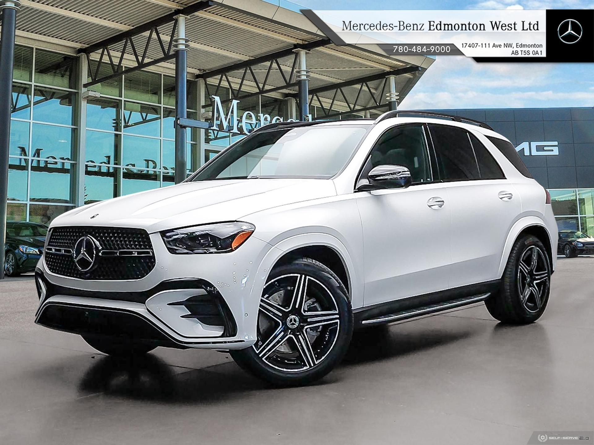

# 0022 入手賓士

清晨
陽光透過窗簾灑在餐桌上溫暖的光線灑在一切之上
張曉彤目不轉睛地看著子楓
注意到他背脊挺直
微微抬頭
雙手優雅地夾起食物
舉止間盡顯貴族風範
她的眼神中透出一種疑惑

子楓察覺到她的目光
心裡有些哭笑不得
老實說
這種感覺不太舒服
是不是成為一個優雅的貴族也需要付出代價？
他不禁想到
現在的自己似乎失去了曾經"耍廢"的簡單快樂

吃完早飯後，子楓決定使用 "初級隨機車卡"

耳邊響起了拉拉的聲音：
"車型篩選中……
恭喜弟弟，你獲得了 `'賓士 GLE 350 4MATIC'`

#### 賓士 GLE 350 4MATIC

>是一款兼具豪華與性能的中大型 SUV，專為追求舒適與越野能力的車主打造
同時標配 4MATIC 全時四驅系統
讓駕駛者在各種路況下都能輕鬆駕馭
車身尺寸：車長 4.93 米，軸距達到 2.95米，提供寬敞的車內空間，
後排座椅支持多角度調節，兼顧乘坐舒適性與空間靈活性
訂單信息已生成，請弟弟聯繫海市星徽賓士 4S 店進行領取，可指定車身及內飾顏色"

"GLE 350 4MATIC！？"
子楓忍不住用力握了握拳
臉上露出了滿滿的喜悅

隨即
他開始瀏覽不同顏色的 GLE 350 4MATIC 配色方案
每一種顏色都獨具特色
讓他一時難以抉擇
他甚至專門點開幾個汽車達人的評測視頻
仔細對比不同配色在陽光下的效果以及內飾搭配的質感
糾結了一陣後
子楓終於敲定了經典的配色方案
白色車身（外）+ 黑色內飾（內）
這樣的搭配既簡約又大氣
與 GLE 350 4MATIC 的優雅設計完美契合

子楓選定顏色後
迅速撥通了海市星徽賓士4S店的電話

"喂，您好，這裡是星徽賓士4S店，請問有什麼可以為您服務？"
接電話的是一位語速很快的女客服
聲音幹練且熱情

子楓斟酌了一下
用穩重的語氣回答：
"你好，我家幫我預訂了一台賓士 GLE 350 4MATIC，想了解一下車輛的具體信息"

"好的先生，麻煩您提供一下姓名、手機號和身份證號"
女客服應聲答道

子楓一一報出了自己的信息
語速清晰

"稍等，我幫您查詢一下"
對方禮貌地說完後
短暫的沉默讓子楓不自覺地坐直了身體

片刻後
女客服的聲音再次響起
比剛才更加熱情：
"劉先生，查到了！您通過我們總公司的渠道訂購了一輛賓士 GLE 350 4MATIC，總價包含了上牌、保險、購置稅以及所有選裝配置，費用已結清"

聽到對方給出的確切信息
子楓心中的一塊石頭終於落了地
"我想再確認一下車子的內外配色"

"沒問題，您說，我這邊幫您紀錄一下！"
女客服語氣中透著一絲雀躍

"外觀是極地白，內飾是黑色"
子楓肯定地說

"劉先生，您這個配色真的是非常經典又大氣，眼光真好！"
女客服帶著笑意稱讚道

"那我大概什麼時候可以提車？"
這是子楓最關心的問題

他從網上了解到
賓士的訂車流程往往需要兩個多月的等待時間

"稍等一下，我幫您聯繫一下領導確認提車時間，稍後會回電給您"
女客服語氣溫和而專業

"好的，謝謝"
子楓掛了電話
靠回沙發上
耐心等待
五分鐘後

"如果兩個人的天堂，像是溫馨的牆..."
熟悉的鈴聲響起
子楓立即接起

"喂，劉先生，抱歉讓您久等了！"
女客服的聲音依然熱情
"根據我們的排產進度和您的選裝配置，正常情況下需要60天左右的時間不過，我們的'趙總'剛剛幫您向總部特別申請，可以從外地調配一輛現車過來，配色和選裝都與您的訂單一致，七天後，您就可以提車上牌了！"

她在"趙總"兩個字上特意加重語氣
似乎有意提醒對方這份安排的特別之處

子楓心中一陣驚喜
但語氣依然保持平靜：
"好的，非常感謝"

"應該的！對了，您的微信號應該是這個手機號吧？我加一下您，稍後會把提車的具體流程和相關事宜發送給您，有問題您可以隨時聯繫我"

"是的，沒錯"

"那好，劉先生就不打擾您了！如果有其他需要隨時聯繫，再見！"

"再見"
子楓掛掉電話
心情大好
忍不住握緊拳頭

"七天，也就是下週二"
他輕聲自語這個速度遠遠超過了他的預期

"有一種愛叫做放手，為妳…"
怎麼手機又響了
本來以為是4S店又有什麼事情
結果看到螢幕上顯示的是一個未知號碼
眉頭微微一挑
隨手接起電話
"喂，您好，哪位？"
他禮貌地問道

"請問是子楓先生嗎？"
電話那頭傳來一名聲音甜美的女子

"是我，請問您是？"
子楓應了一聲
語氣中帶著一絲好奇
儘管心裡有些疑慮
覺得這通電話可能是某種推銷或詐騙
但他還是保持了耐心

"子楓先生，冒昧打擾您，抱歉"
女子繼續說道
經過確認子楓的身份後
她的語氣明顯更恭敬

"自我介紹一下，我是工商銀行海市分行的專屬客服宋婉婷，由於您在我行的存款已超過500萬，首先非常感謝您對我們的信任，我們想誠摯地邀請您加入我們的超高端私人銀行，並為您量身打造一系列專屬的貴賓服務，不知道您是否方便，是否願意來本行升級您的儲蓄卡？順便跟您報告專屬的服務"

子楓稍微思索了一下
" 好的，那就下午吧"
他淡定答复

"好的，期待下午與您的會面"
宋婉婷的聲音中透著期待

掛斷電話後
子楓轉向旁邊的張曉彤
"曉彤姐，午餐過後，我得去趟工商銀行海市分行幫我跟司機說一聲"
他叮囑道
張曉彤點點頭

迅速拿起電話開始聯繫
用完早餐後
子楓便開始了今天的鍛煉

今天張曉彤幫子楓安排的是一次全身的綜合訓練
他以深蹲跳開始
用來啟動全身肌肉的協調性
接著進行了波比跳
訓練爆發力與有氧耐力

他還加入了「超人挺身」動作
強化下背部肌肉
同時改善久坐帶來的腰酸問題

最後，子楓花了20分鐘進行拉伸
包括臀部、腿筋、肩膀等部位，讓身體得到全面的放鬆

幾個小時候
子楓坐在庫里南的後座
車窗外的風景緩緩掠過
司機從後視鏡裡瞥了他一眼
眼神中滿是疑惑
心裡暗自嘀咕：
"這不就是專車嗎？硬是讓你坐出個總裁範兒了
真有那味兒"